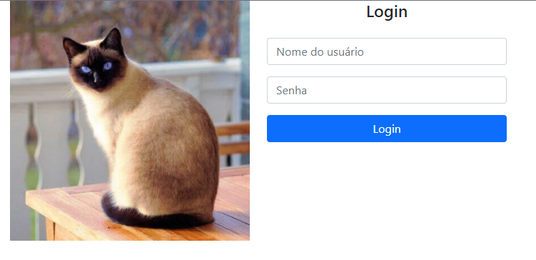

# GatitoBook

## Português

GatitoBook é uma aplicação web que simula uma rede social para os amantes de gatos, contanto com uma tela home com login e serviços como autenticação e comunicação com uma API externa.

Esse projet foi feito a partir do segundo curso da formação em Angular da [Alura Cursos Online](https://www.alura.com.br/).

Esse é um preview do projeto.

Esse projeto foi gerado utilizando o [Angular CLI](https://github.com/angular/angular-cli) versão 10.1.6.

### Servidor de desenvolvimento

Rode `ng serve` para um servidor local. Navegue para `http://localhost:4200/`. O aplicativo recarrega automaticamente com qualquer mudança nos arquivos do projeto.

### Ajuda

Para conseguir mais ajuda no Angular CLI use `ng help` ou de uma olhada no [Angular CLI README](https://github.com/angular/angular-cli/blob/master/README.md).

## English

GatitoBook is a web-app that simulates a social network for cat lovers, with a homepage, login authentication and data fetching from an extern API.

This project was build with the inicial course of Angular 10 on [Alura Cursos Online](https://www.alura.com.br/).

This is a preview of the project.

This project was generated with [Angular CLI](https://github.com/angular/angular-cli) version 10.1.6.

### Development server

Run `ng serve` for a dev server. Navigate to `http://localhost:4200/`. The app will automatically reload if you change any of the source files.

### Further help

To get more help on the Angular CLI use `ng help` or go check out the [Angular CLI README](https://github.com/angular/angular-cli/blob/master/README.md).
